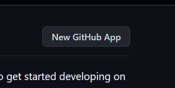

# Contributing Guide

Thank you for investing your time in contributing to our project! Any contribution you make will be appreciated :sparkles:.

Read our [Code of Conduct](./CODE_OF_CONDUCT.md) to keep our community approachable and respectable.

In this guide you will get an overview of the contribution workflow from opening an issue, creating a PR, reviewing, and merging the PR.

## New contributor guide

To get an overview of the project, read the [README](README.md). Here are some resources to help you get started with open source contributions:

- [How to Contribute to Open Source](https://opensource.guide/how-to-contribute/)
- [Understanding the GitHub flow](https://guides.github.com/introduction/flow/)

- [GitHub Help Documentation](https://help.github.com/)
- [GitHub Flavored Markdown](https://guides.github.com/features/mastering-markdown/)

## Getting started

### Fork the repository

Fork the project [on GitHub](https://github.com/Bootcamp-Projects-Hamechina/hamechina)

### Clone the project

Clone your fork locally. Do not clone the original repository unless you plan to become a long-term contributor and have been given permission to do so.

```shell
git clone https://github.com/[your-github-user]/hamechina
cd hamechina
```

### Install dependencies

Install the project dependencies:

```shell
npm i
# or:
yarn
```

### Create a branch

Create and check out your feature branch:

```shell
git checkout -b my-new-feature
```

### Getting Started

- Go to .env.example and copy the file.
- Create .env.lacal file and paste.
- In bash/Linux terminal, create your secret: `` openssl rand -hex 32` or go to https://generate-secret.now.sh/32 ``

#### To get your GITHUB_ID & GITHUB_SECRET:

- Go to: https://github.com/settings/apps
- Click on "New GitHub App"

  

- You can follow this tutorial on how to add an app on github, minute 12:40: https://www.youtube.com/watch?v=w2h54xz6Ndw&list=PL0Zuz27SZ-6Pk-QJIdGd1tGZEzy9RTgtj&index=19
- Get your GITHUB_ID & GITHUB_SECRET, copy&paste to your .env.local
- Resources: https://next-auth.js.org/providers/github

#### To get your GOOGLE_CLIENT_ID & GOOGLE_CLIENT_SECRET:

- https://next-auth.js.org/providers/google

### Or (How to get your GITHUB_ID & GITHUB_SECRET / GOOGLE_CLIENT_ID & GOOGLE_CLIENT_SECRET):

Talk to me, I'll give you mine :happy

### Make changes locally

### Commit your changes

Commit your changes:

```shell
git commit -m 'Add some feature'
```

### Push your changes

Push your changes to your fork:

```shell
git push -u origin my-new-feature
```

### Create a pull request

When you're finished with the changes, create a pull request, also known as a PR.

<!-- - Fill the "Ready for review" template so that we can review your PR. This template helps reviewers understand your changes as well as the purpose of your pull request. ?? check this..-->

### Issues

#### Create a new issue

If you spot a problem in the codebase that you believe needs to be fixed, or you have an idea for a new feature, take a look at the [Issues](https://github.com/Bootcamp-Projects-Hamechina/hamechina/issues).

If you can't find an open issue addressing the problem, open a new one. Be sure to include a title and clear description, as much relevant information as possible, and a code sample or an executable test case demonstrating the expected behavior that is not occurring.

#### Solve an issue

Scan through our [existing issues](https://github.com/Bootcamp-Projects-Hamechina/hamechina/issues) to find one that interests you. You can narrow down the search using `labels` and `projects` to find issues that need attention.

Then, fork the repository (if this is your first contribution to this project. Otherwise, sync your fork), create a branch, and make your changes.

Finally, open a pull request with the changes.

### Your PR is merged

Congratulations :tada::tada: The GitHub team thanks you :sparkles:.

Once your PR is merged, your contributions will be publicly visible on the [hamechina](https://github.com/Bootcamp-Projects-Hamechina/hamechina).

### Credits

This Contributing Guide is adapted from [GitHub docs contributing guide](https://github.com/github/docs/blob/main/CONTRIBUTING.md?plain=1).
